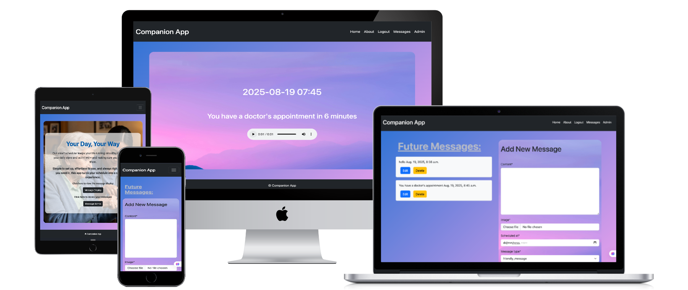
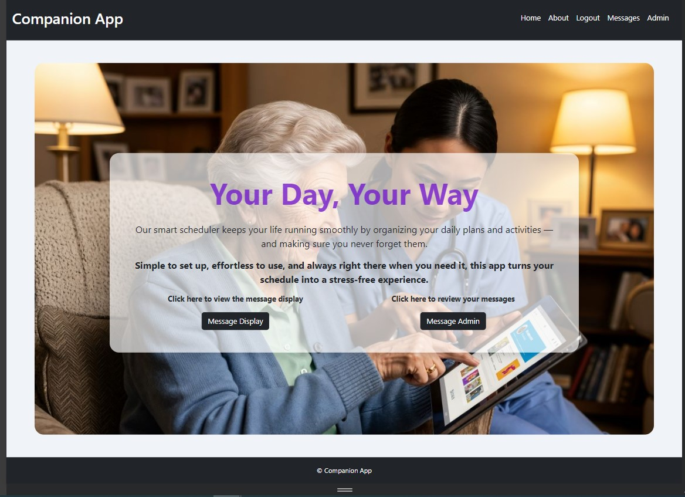

# Companion app



<a href="https://hackathon2-helper-182de8322106.herokuapp.com/" target="_blank">Visit Companion App</a>

## Collaborators

Working together on this project via Discord was a highly rewarding experience for all of us. We enjoyed collaborating, sharing ideas, and learning from each other. For the second time we were able to practice coordination across a team. Ensuring that everyone was on the same page and managing merge conflicts required effective communication and organization. This experience has significantly improved our teamwork and version control skills.

# Team Awesome

- [Jamie](https://github.com/JamieJB123) - Lead
- [David Noble](https://github.com/dav-noble)
- [Marc](https://github.com/msaunders4-bc)
- [Marijonas](https://github.com/Marso22)
- [AlexM](https://github.com/Alex-McAlpine)


## Table of Contents

- [Features](#features)
- [Responsive Design](#responsive-design)
- [Learning Outcomes & Reflections](#learning-outcomes--reflections)
   - [Front-End Design](#front-end-design)
   - [Database](#database)
   - [Agile Methodology](#agile-methodology)
   - [Code Quality](#code-quality)
   - [Documentation](#documentation)
   - [Data Model, Application Features, and Business Logic](#data-model-application-features-and-business-logic)
   - [Authorization, Authentication, and Permissions](#authorization-authentication-and-permissions)
   - [Version Control and Secure Code Management](#version-control-and-secure-code-management)
   - [Cloud Deployment and Security](#cloud-deployment-and-security)
   - [Object-Based Software Concepts and Custom Data Models](#object-based-software-concepts-and-custom-data-models)
   - [Leveraging AI Tools in Software Development](#leveraging-ai-tools-in-software-development)
- [Setup Instructions](#setup-instructions)
- [License](#license)
- [Credits](#credits)


## Features

- User registration, login and logout (via Django Allauth)
- Message display page: Messages are displayed differently depending on conditional logic.
   - If the message is a 'task notification' (e.g. doctor's appointment) it will display 30 minutes before the scheduled at time. It will also have a 'count down' until the scheduled time.
   - If the message is a 'friendly message' (e.g. Good morning!) it will appear 2 minutes before the scheduled time and it will not have a count down.
   - If there is a message to be displayed, there will also be an 'audio' element with the message converted using Google's Text-to-Speech API.
   - If there is not a message to display, a default message will be displayed on the screen ("Hello <user>, no message to display")
- There is a JavaScript script which functions like an API call every 30 seconds to check whether the message display needs to change. This ensures that messages are updated continuously without the user continuously needing to refresh the page.
- Admin Message Display:
   - There is a user admin panel in which they can create new messages, attach an image to the message, and determine which 'type' of message it is.
   - The admin panel will also display all future messages which have been scheduled.
   - From the admin page user's can edit or delete any future messages which they have created.
- Bootstrap toast notifications for message edit/delete
- Responsive design for desktop and mobile
- Django admin for message management

## Responsive Design


*Mobile layout showing responsive navigation and content.*


*Desktop layout with expanded navigation and content.*


## Learning Outcomes & Reflections

### Front-End Design
The Companion app features a user-friendly interface with consistent styles, clear navigation. Semantic HTML is used throughout, with attention to accessibility guidelines such as colour contrast and alt text. The layout adapts to different screen sizes using CSS media queries and Bootstrap, with no major WCAG errors detected.

### Database
A configured Django web application manages data records using a connected database. Custom model for messages is implemented with appropriate fields, relationships, and constraints. Django’s ORM is used for efficient and secure data management.

### Agile Methodology
An Agile tool was used to plan and track all major functionality. User stories were documented and linked to project goals and deliverables within the tool, supporting iterative development and clear progress tracking.

### Code Quality
Custom Python logic is included, demonstrating proficiency with if-else conditions and loops. The codebase follows readability standards, proper indentation, and meaningful naming conventions. Files are named consistently and descriptively, avoiding spaces and capitalization for cross-platform compatibility.

### Documentation
The README is well-organized, detailing the UX process, design rationale, and final implementation.

### Data Model, Application Features, and Business Logic

#### Database Development
A well-organised and consistent database schema was developed using Django’s ORM. The data model includes clearly defined table for users, message contents, its creation and update date and time, scheduled date and time, with relationships established through foreign keys. Consistent use of data types and constraints ensures data integrity, and Django migrations were used to manage schema changes and maintain version control.

#### CRUD Functionality
The application provides user-friendly interfaces for creating, reading, updating, and deleting (CRUD) records, primarily through the Django admin and custom forms.

#### User Notifications
Users receive clear and concise notifications for relevant data changes.

#### Forms and Validation
Forms are implemented for creating and editing models, with robust backend validation to ensure data quality. The forms feature clear labels, accessible design, and informative error messages for invalid submissions, enhancing usability and accessibility for all users.

### Authorization, Authentication, and Permissions

#### Role-Based Login and Registration
A secure role-based login and registration system is implemented using Django Allauth and Django’s built-in authentication. User credentials and sensitive information are handled securely. Registration and login interfaces are user-friendly, with validation and informative error handling.

#### Reflect Login State
The application accurately reflects the current login state across all pages. Visual indicators such as the logout button and conditional navigation links show whether a user is logged in. Content is conditionally rendered based on the user’s login state and role.

#### Access Control
Access control is enforced to restrict content and functionality based on user roles. Unauthorised access attempts result in clear error messages or redirects, ensuring users cannot access restricted areas without appropriate permissions.

### Version Control and Secure Code Management

#### Version Control with Git & GitHub
Git was used for version control throughout the project, with regular and meaningful commit messages documenting incremental development and progress. The GitHub repository provides a comprehensive commit history, reflecting the evolution of the application and supporting collaboration and transparency.

#### Secure Code Management
All sensitive information, such as passwords and secret keys, was excluded from the repository using environment variables and a properly configured `.gitignore` file. This ensures secure code management and protects confidential data during deployment to GitHub and the hosting platform.

### Cloud Deployment and Security

#### Deploy Application to Cloud Platform
The final version of the Companion app was successfully deployed to a cloud-based hosting platform (Heroku). The deployed application matches the development version in functionality, with all features verified post-deployment. The hosting environment was properly configured to support Django, static files, media storage, and environment variables.

#### Document Deployment Process
The deployment process is clearly documented in the README, with step-by-step instructions for setting up, configuring, and deploying the application to Heroku. This includes installing dependencies, applying migrations, setting environment variables, and verifying the live site.

#### Ensure Security in Deployment
Security was ensured throughout deployment by excluding passwords and sensitive information from the git repository, using environment variables and `.gitignore` for secret keys and configurations, and setting `DEBUG = False` in the production environment. This protects confidential data and ensures the application runs securely in the cloud.

### Object-Based Software Concepts and Custom Data Models

#### Design and Implement a Custom Data Model
A custom data model was designed and implemented to fit the specific requirements of the Companion app. Django’s ORM was used to define models for posts, comments, and users, establishing appropriate fields and relationships. The data model supports all core features of the application and demonstrates effective use of object-based software concepts in full-stack web development.

### Leveraging AI Tools in Software Development

#### Use AI Tools to Assist in Code Creation
AI tools, including GitHub Copilot, were strategically used to generate Django views, forms, models, and utility functions. This accelerated development and ensured code was aligned with project objectives and best practices.

#### Use AI Tools to Assist in Debugging Code
AI assistance was leveraged to efficiently identify and resolve bugs, such as issues with static file collection and message display logic. Copilot provided suggestions that helped pinpoint and fix errors quickly, improving overall code reliability.

#### Use AI Tools to Optimize Code for Performance and User Experience
AI-driven recommendations contributed to performance and user experience improvements, including optimising Bootstrap toast notifications and responsive design for mobile and desktop users. Minimal documentation of AI use was maintained, focusing on outcomes.

#### Reflect on AI’s Role in the Development Process and Its Impact on Workflow
AI tools significantly enhanced workflow efficiency, enabling rapid prototyping, streamlined debugging. The development process was more productive and focused on outcomes, with less time spent on repetitive coding tasks.

## Bugs:

- Text-to-speech:
   - Initially we wanted the text-to-speech conversion to be automatic. We wanted the audio to play automatically when a user navigated to the message-display page. We also wanted this audio to play periodically as the time counted down towards the scheduled time.
   - However, when we tried to implement this we discovered that this is impossible because modern web-browsers block this behaviour for accessibility and user-experience reasons. This was useful to discover. This sort of application is not best suited to a web-application.
   - There are also a few issues with the text-to-speech currently which we were unable to resolve due to time-constraints. Currently, the text-to-speech functionality is only called when the user navigates to the message-display page or when they refresh the page. Therefore, the audio does not update with the text (because it is not updated with the javascript API call).
   - There is also another issue with the text-to-speech. Currently, the audio for the next scheduled message is available irrespective of how long before the 'scheduled-at' time it is. Therefore, the audio can be out of sync with the text (as the text is conditionally displayed depending on how long before the scheduled-time it is).


## Setup Instructions

1. **Main repository:**

   https://github.com/JamieJB123/hackathon2


2. **Install dependencies:**
   ```bash
   python -m venv .venv
   .venv\Scripts\activate
   pip install -r requirements.txt
   ```

3. **Apply migrations:**
   ```bash
   python manage.py migrate
   ```

4. **Create a superuser:**
   ```bash
   python manage.py createsuperuser
   ```

5. **Run the development server:**
   ```bash
   python manage.py runserver
   ```

6. **Access the site:**
   - Main site: [https://hackathon2-helper-182de8322106.herokuapp.com/](https://hackathon2-helper-182de8322106.herokuapp.com/)
   - Admin: [https://hackathon2-helper-182de8322106.herokuapp.com/admin/](https://hackathon2-helper-182de8322106.herokuapp.com/admin/)


## License

MIT License

## Credits

- [Django](https://www.djangoproject.com/) — Web framework powering the application.
- [Bootstrap](https://getbootstrap.com/) — CSS framework for responsive design and toasts.
- [GitHub Copilot](https://github.com/features/copilot) — AI tool for code generation and testing.
- [Heroku](https://www.heroku.com/) — Cloud platform for deployment.
- [Cloudinary](https://cloudinary.com/) — Media storage and management.
- [W3C Markup Validation Service](https://validator.w3.org/) — Used for HTML/CSS validation.
- [Invideo AI](https://invideo.io/) — AI-powered image & video creation and editing tool.
- [Google Text-to-Speech API](https://cloud.google.com/text-to-speech/docs/reference/rest)
- Thanks to YouTuber Jie Jenn for a super useful [YouTube Tutorial](https://www.youtube.com/watch?v=GVPWz-nhJhg&list=PL4kPG-rWg6f_HHelBUs27x1EY5rx-HVnH&index=5) on using Google text-to-speech API.
- Any additional libraries, tutorials, or resources used in development.


*Special thanks to all contributors and the open-source community for their support and resources.*


